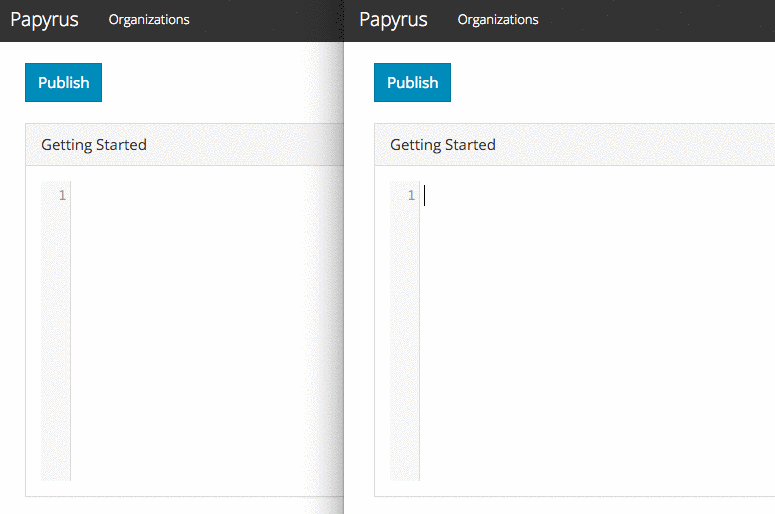

# Papyrus

Papyrus is a real-time collaborative Markdown editor and document repository with simple organization and project-based management. At [Furqan Software](https://furqansoftware.com) we always wanted a simple way to collaborate on Markdown documents and Papyrus is our stab at fulfilling that need.



As of writing this README.md, [GopherGala 2016](http://gophergala.com/)'s 48 hours is almost up. The core collaborative editing functionality, namely operational transformation and other relevant constructs, have been implemented. The webapp is lacking some functionalities (e.g. removing a member that has been added to a project, deleting a document, etc). At this moment, you can login using a Google or GitHub account, create organizations, create projects, create documents and start editing them collaboratively in real-time.

## Usage

Clone this repository:

``` sh
git clone https://github.com/gophergala2016/papyrus.git .
```

Build _papyrusd_ binary (after `cd`-ing into the directory):

``` sh
go build ./cmd/papyrusd
```

Create a `.env` file and update it as needed:

``` sh
cp env-sample.txt .env
```

Start Papyrus using `docker-compose`:

``` sh
docker-compose up
```

Open your web browser and navigate to [localhost:15000](http://localhost:15000).

## Acknowledgements

- [CodeMirror](https://codemirror.net/) - One fantastic text editor for the web
- [Code Commit](http://www.codecommit.com/blog/java/understanding-and-applying-operational-transformation) - For their amazing explanation of operational transformation
- [OT Explained](http://operational-transformation.github.io/visualization.html) - That visualization!
- [golab](https://github.com/mb0/lab) - For the insights we got from its code

## License

Papyrus is available under the [BSD (3-Clause) License](http://opensource.org/licenses/BSD-3-Clause).
